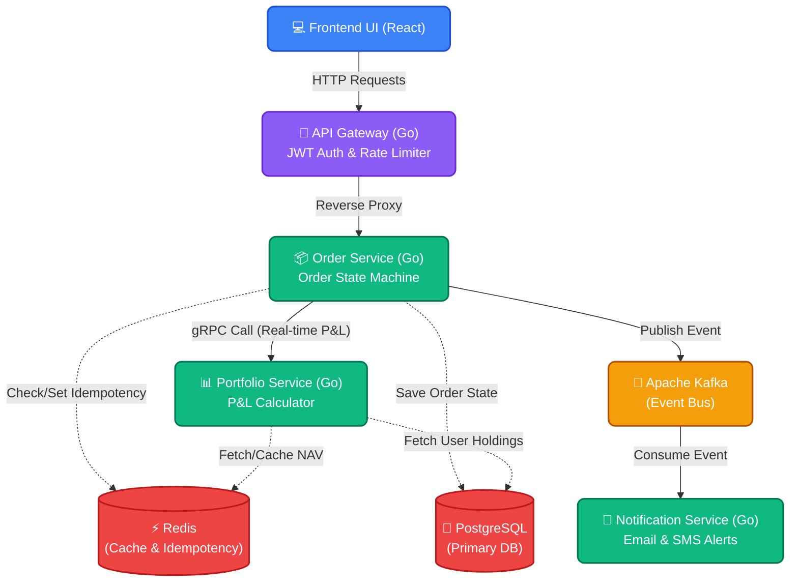

# FinFlow — Mutual Fund & SIP Order Processing System

Welcome to **FinFlow**! This is a complete, production-ready microservices application designed to process mutual fund and SIP (Systematic Investment Plan) orders. It simulates a modern fintech architecture using event-driven design, caching, gRPC, and a clean React frontend.

Whether you are a developer looking to understand the architecture or a tester wanting to see it in action, this guide will walk you through everything from scratch.

---

## 🏛️ System Architecture

FinFlow is built using a modern decoupled architecture. Below is the system design flowchart detailing how the components interact:



---

## 🚀 Services Overview

### 1. API Gateway (Port `8080`)
- **Role:** The front door of the backend. It routes traffic to the correct microservices.
- **Security:** Implements **JWT Authentication** to secure endpoints and **Token Bucket Rate Limiting** to prevent spam and abuse.
- **Endpoints:** `/login` (generates a test JWT), `/orders`, `/portfolio`, `/services/health`.

### 2. Order Service (Port `8081` internally)
- **Role:** The core engine. It handles placing SIP and Lumpsum orders.
- **Features:** 
  - Maintains an Order State Machine (`PENDING` → `PROCESSING` → `EXECUTED` / `FAILED`).
  - Uses **Redis** to store idempotency keys so users can't accidentally submit the exact same order twice.
  - Saves order data reliably to **PostgreSQL**.
  - Publishes `order_events` to Kafka whenever an order's status changes.

### 3. Portfolio Service (Port `50051` gRPC)
- **Role:** Calculates user Profit & Loss (P&L) in real-time.
- **Features:**
  - Exclusively communicates with the Order Service via blazing-fast **gRPC**.
  - Calculates Unrealized Gains based on Current NAV (Net Asset Value).
  - Uses **Redis** to cache NAV prices with a Time-To-Live (TTL) to reduce database load.

### 4. Notification Service (Background Worker)
- **Role:** An asynchronous event listener. 
- **Features:**
  - Constantly listens to the **Kafka** `order_events` topic.
  - When an order changes state (e.g., Executed successfully), it simulates sending out Email and SMS alerts to the user.

### 5. Frontend UI (Port `5173`)
- **Role:** A modern dashboard built with React, Vite, and Tailwind CSS.
- **Features:** Allows you to log in (to get a JWT), place orders, view your portfolio's real-time P&L, and monitor the health of the entire backend stack.

### 6. Infrastructure & Monitoring
- **Kafka & Zookeeper:** The message broker handling asynchronous events.
- **Prometheus & Grafana (Ports `9090` & `3000`):** Automatically scrapes metrics from the services so you can build visualization dashboards.

---

## 🏃‍♂️ How to Run the Project (From Scratch)

You don't need to install Go, Node.js, or any databases to run this. Everything is containerized!

### Prerequisites
- Install [Docker](https://docs.docker.com/get-docker/) and Docker Compose on your machine.

### Step-by-Step Guide

**1. Clone the repository and navigate to the project folder:**
```bash
git clone <your-repo-url>
cd FinFlow
```

**2. Start the entire application stack:**
```bash
docker compose up -d --build
```
*(This command downloads the databases, compiles the Go services, builds the React frontend, and starts them all in the background. It may take a minute or two on the first run).*

**3. Open the Frontend UI:**
Once the containers are running, simply open your browser and navigate to:
👉 **[http://localhost:5173](http://localhost:5173)** 

*(On Windows, you can type `start http://localhost:5173` in your terminal to open it instantly).*

---

## 🧪 How to Test and Verify Everything Works

The easiest way to test the system is entirely through the **Frontend UI (http://localhost:5173)**. 

1. **Log In:** When you open the UI, you will be met with a Login screen. Click the **"Login with Dummy Token"** button. The frontend will hit the API Gateway, retrieve a JWT, and securely log you into the dashboard.
2. **Check Service Health:** On the left sidebar, you'll see a green "All services healthy" pill. You can view the specific status of the Gateway, Order, and Portfolio services in the dashboard.
3. **Place an Order:** 
   - Enter a User ID, select a Fund, enter an amount, and hit **Submit order**.
   - Your order will instantly appear in the "Latest orders" table as `PENDING`.
4. **Change Order State:** 
   - Next to your `PENDING` order, click **Process**. The status will change to `PROCESSING`.
   - Next to your `PROCESSING` order, click **Execute**. The status will change to `EXECUTED`.
5. **View the Notifications:** 
   - Every time you change the state of an order (e.g., Executed), an event is sent through Kafka.
   - You can see the simulated Email/SMS alerts by viewing the Notification Service logs in your terminal:
     ```bash
     docker compose logs -f notification-service
     ```
6. **Check Portfolio P&L:** Enter the User ID you used to place the order and click **Fetch P&L** to see the gRPC service calculate your real-time Unrealized Gains!

### Stopping the Project
When you're done testing, you can shut down all services and clean up by running:
```bash
docker compose down
```
